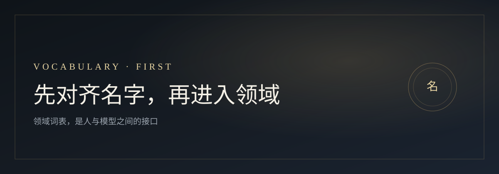

<p align="center">
  
</p>

<h1 align="center">Vocabulary-First</h1>

<p align="center">
  <em>「先对齐名字，再进入领域。」</em>
</p>

<p align="center">
  <a href="LICENSE"></a>
  <a href="docs/01-problem.md"></a>
  <a href="examples/http-api.md"></a>
</p>

<p align="center">
  <strong>领域词表，是人与模型之间的接口。</strong><br/>
  先拿到高密度术语，再提问、讲解、派活；方法可回流成 skill。
</p>

<p align="center">
  <a href="#这是什么">这是什么</a> ·
  <a href="#结论">结论</a> ·
  <a href="#怎么用">怎么用</a> ·
  <a href="#文档">文档</a> ·
  <a href="#样例">样例</a>
</p>

---

## 这是什么

几个词一出现，双方就站到同一张领域地图上。

- 说到 `header` / `body`，不必声明「我在谈 HTTP」
- 说到「反代」，在特定圈子里会带上网关、上游、token 整条链路

那不是装腔，而是 **入口词 + 骨架词 + 圈内高信号暗号**。

本仓库要回答两件事：

1. 这类词，在提示里该怎么**总称**，才问得准  
2. 拿到词表之后，怎样**反向建图、正向干活**，并逐步收成 skill

---

## 结论

**没有唯一官方名。** 对外可统称：

> **Vocabulary-First** / **Glossary-First**

| 日常三件套 | 作用 |
|---|---|
| **seed terms** | 很少的入口种子，一说就定位 |
| **core lexicon / glossary** | 骨架术语，撑起地图 |
| **shibboleths** | 圈内高信号暗号（也作 high-signal jargon） |

写进提示时也很贴：**anchor terms / semantic anchors**、**trigger terms**、**threshold concepts**、**concept map**、**entry vocabulary**。

同思路的公开实践：[Vocabulary-First Onboarding](https://forge.itsbroken.ai/techniques/fg-0108.html) · [Glossary-First Prompt](https://dev.to/novaelvaris/the-glossary-first-prompt-align-on-terms-before-you-ask-for-code-dbn) · [Semantic Anchors](https://github.com/LLM-Coding/Semantic-Anchors)

---

## 怎么用

```text
反向要词表 → 消化 / 收藏
正向用词表要细节或派活
卡住就先补词，再继续
回流进词表与 skill
```

可复制提示见 [docs/03-bidirectional-usage.md](docs/03-bidirectional-usage.md)。  
若要把方法压成 skill，见 [docs/05-skill-seeds.md](docs/05-skill-seeds.md)。

---

## 文档

| | |
|---|---|
| [01 · 问题从哪来](docs/01-problem.md) | 疑惑、目标、共识 |
| [02 · 词表家族](docs/02-vocabulary-family.md) | 总称簇与取舍 |
| [03 · 双向用法](docs/03-bidirectional-usage.md) | 反向 / 正向提示 |
| [04 · 证据与链接](docs/04-evidence-and-links.md) | 外部出处 |
| [05 · Skill 种子](docs/05-skill-seeds.md) | 压缩协议给模型用 |
| [样例 · HTTP API](examples/http-api.md) | 一份填好的小词表 |

正文用第三人称直叙，方便自己回看，也方便转给别人。

---

## 样例

摘自 [examples/http-api.md](examples/http-api.md)：

| 层 | 词 | 一句话 |
|---|---|---|
| seed | `status code` | 响应结果的编号语言 |
| core | `idempotent` | 同一请求做多次，效果应与一次相同 |
| shibboleth | `REST vs RPC` | 一开口就暴露接口风格立场 |

---

## 许可

[MIT](LICENSE)

---

<p align="center">
  <sub>命名精度，预测协作速度。</sub><br/>
  <sub><em>Name things first. Then ask for depth.</em></sub>
</p>
